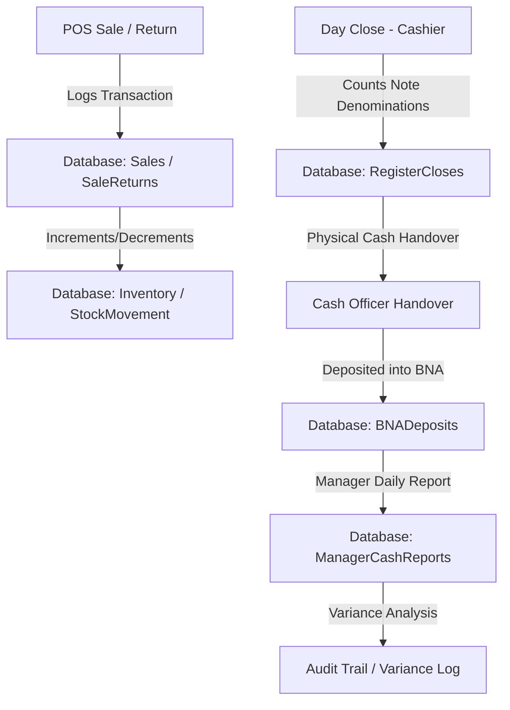

# Architecture - Afreen Mall Internal Operations Platform

## Overview
This document outlines the architecture for the Afreen Mall Internal Operations Platform, a staff-only retail management system.

## System Components
1. **Frontend (React + Vite + TypeScript)**: A single-page application built for modern desktop browsers, designed for shop-floor PCs. Kept free of browser-only APIs and IPC dependencies to support Electron/Tauri wrap later.
2. **Backend (NestJS + TypeScript)**: A modular monolithic backend providing REST APIs under `/api/v1/`. Each business area is isolated into its own NestJS module.
3. **Database (PostgreSQL)**: Relational database storing transactional, inventory, and user data. Money is stored as integers (paise). Parameterized queries via Prisma.
4. **Cache & Session Store (Redis)**: Used for access/refresh token blacklisting, session state, and fast lookup caching of hot products/prices.
5. **Hardware Integration Layer**: A decoupled NestJS module and React client service defining interfaces for:
   - Barcode Scanner (HID keyboard wedge simulation)
   - EDC Card Payment Terminal (Mock integration)
   - UPI QR Code Generator (Base64 QR image generation containing transaction metadata)
   - Thermal Receipt Printer (Text format buffer simulation)

## Authentication & RBAC
- Numeric 6-digit Staff ID starting at `300000` (auto-incrementing).
- Role-based Access Control (RBAC) enforced on the server for all routes.
- Access token (JWT, 15 min lifetime) + Refresh token (7 day lifetime, HttpOnly cookie).
- User management is restricted entirely to the `Super Admin` role (`Superkhan` seed).

## Data Flow: POS Cash Handover & Reconciliation

