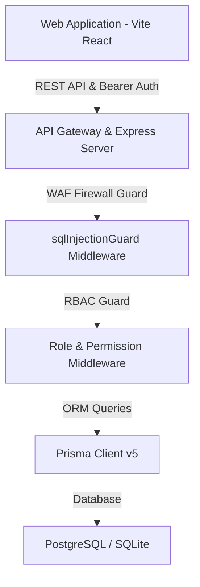

# 🛍️ AFREEN MALL — Enterprise POS & Operations Platform

> **Military-Grade, Bank-Secured Point of Sale & Retail ERP System**  
> Designed for High-Volume Retail Superstores, Hypermarkets, and Multi-Counter Malls.

---

---

## 🌟 Comprehensive Feature Showcase (Minor to Major)

### 💳 1. Manual Bill Recovery — Card/UPI Payment Failures (`Shift + F8`)
- **Scenario**: Customer's card or UPI payment succeeds at the bank/EDC terminal, but POS printer paper jams or fails before generating the bill.
- **Cash Officer Verification**: Cash Officer verifies bank receipt, then triggers **`Shift + F8`** (or clicks **Recover Bill** in the header bar).
- **Data Capture**: Requests mandatory **Transaction ID** (text), **Amount Paid** (currency > ₹0), and **Payment Mode** (Card/UPI).
- **Duplicate Prevention**: Live WAF check blocks duplicate Transaction IDs.
- **Audit Compliance**: Immutable entry logged to `AuditLog` table.

---

### 🖨️ 2. Strict One-Time Original Print & Authorized Duplicate Copy (`Ctrl + F5`)
- **Strict 1-Time Original Rule**: Original receipt prints strictly **ONCE** upon payment completion. Automatic re-printing is prohibited.
- **Duplicate Reprinting**: Triggered via **`Ctrl + F5`** or **Print Duplicate** header action button.
- **Supervisor Role Guard**: Restricted to Cash Officer, Store Manager, Super Admin, Accountant, and Auditor. Standard cashiers see a supervisor warning.
- **Prominent Watermark**: Formats receipt header & footer with `*** DUPLICATE COPY *** (NOT AN ORIGINAL RECEIPT)`.
- **Audit Tracking**: Every duplicate print records staff ID, invoice number, reprint count (`reprintCount`), timestamp, and reason into `AuditLog`.

---

### 🖥️ 3. POS Register Auto-Feed / Terminal Selection (`[ POS-01 ]`)
- **Post-Login Terminal Feed**: Prompts cashier to select active terminal register (`POS-01 Main Counter`, `POS-02 Express`, `POS-03 Grocery`, etc.) or auto-feeds from memory.
- **Prominent Badge**: Renders an interactive **`[ POS-01 ]`** badge in the header bar. Clicking allows seamless switching.
- **Invoice Tracking**: Every invoice records the active register ID for audit & cash drawer reconciliation.

---

### 💵 4. BNA (Bulk Note Acceptor) Machine Cash Deposit Accounting
- **Accounting Policy**: Cash deposited into the store's BNA machine is physical sales money and is **STRICTLY CLASSIFIED UNDER CASH MONEY** (never mixed into Card or UPI).
- **Formula**: `Total Cash Sales = Counter Notes Cash + BNA Machine Deposited Cash`.
- **Comprehensive Reporting**: Day Close (`DayCloseScreen.tsx`), Cash Reconciliation (`CashReconciliationScreen.tsx`), and Reports (`ReportsScreen.tsx`) display explicit columns for **Counter Cash (₹)**, **BNA Machine Cash (₹)**, **BNA Slip #**, and **Total Cash Sales (₹)**.

---

### 🔒 5. Active Cart Navigation Session Lock Guard
- **Session Locking**: While items exist in the active POS cart, navigating away (via sidebar menu or browser refresh/back) is locked with `beforeunload` session guards.
- **Alert**: Displays alert modal: *"Active Billing Session in Progress: Please complete payment or clear cart before leaving POS screen."*
- **Unlock Condition**: Unlocks automatically once payment finishes or bill is explicitly cancelled.

---

### 🕒 6. Live Real-Time Clock & Dynamic Timestamping
- **Header Badge**: Renders a live ticking clock (**`HH:mm:ss DD/MM/YYYY`**) in the POS top bar that auto-syncs continuously every second.
- **Real-Time Invoice Sync**: Invoices record the exact real-time timestamp upon payment confirmation.

---

### 🛑 7. Item Deletion Rules (1-Item Minimum) & Cancel Bill Workflow
- **1-Item Threshold**: Individual item deletion is permitted down to **1 item**. The final item cannot be deleted individually (trash button disabled with notice: *"At least 1 item must remain in invoice"*).
- **Explicit Cancel Bill Action**: To reset an entire cart, the cashier clicks **Cancel Bill**, prompting a red confirmation modal to reset the cart session.
- **Delete Key Removal**: Keyboard `Delete` key single-item shortcut is disabled to prevent accidental item deletion during fast barcode scanning.

---

### 🎨 8. Unified Emerald/Green Aesthetics (Dark & Light Theme Alignment)
- **Design Tokens**: Dark mode `--accent-lime` and `.btn-primary` button styles use matching vibrant emerald green (`#10b981` / `#059669` with white text contrast).
- **Consistent Aesthetics**: Both Dark and Light themes feature identical green action buttons for brand consistency.

---

### 🖨️ 9. Automated Thermal Receipt Auto-Print on Payment Success
- **Immediate Print**: As soon as payment confirmation completes (Cash, Card, or UPI), the system automatically triggers `window.print()` after 400ms so connected thermal printers immediately print the receipt.

---

### 👤 10. Dedicated Staff Full Name Box & Interactive Picker (Indian Names)
- **Staff Full Name Box**: Below the 6-digit Staff ID input box on the Login screen, a dedicated **Staff Name Box** auto-populates real Indian full names and surnames (e.g. **Vinayak Shinde**, **Babuji Namole**, **Gous Khan**, **Sanjay Gupta**, **Pooja Sharma**, **Amit Verma**).
- **Directory Picker Modal**: Clicking the Name Box opens an interactive **Staff Directory Picker Modal** listing staff names, roles, and Staff IDs to select and auto-fill login credentials.

---

### 👑 11. Store Manager Staff Management Delegation
- Both **Store Managers** and **Super Admins** can add new staff accounts, assign 6-digit Staff IDs (`300000+`), edit full names, update roles, and manage access permissions.

---

### ⏳ 12. 7-Day Inactivity Auto-Deactivation & Admin Reactivation (Turn ON)
- **Auto-Deactivation**: If a staff member has not logged in for **7 days (1 week)**, the system automatically marks the account as **Deactivated (7-Day Inactive)**.
- **Reactivation Control**: Managers and Super Admins have a **Turn ON (Reactivate)** switch in Staff Settings to restore access anytime.

---

### 🚫 13. Cashier Sale Return Permission Control (`canProcessSaleReturn`)
- **Default Restrict Rule**: Newly added cashiers default to **Sales Only** (`canProcessSaleReturn: false`). Sale Returns are blocked.
- **Manager Toggle**: Managers and Super Admins can grant **Allow Return** permission in Staff Settings.
- **POS Restriction**: Attempting `Alt + F11` or Return Mode without permission displays an explicit permission error toast: *"Permission Denied: Cashier is restricted to sales only. Sale Return permission must be granted by Manager or Super Admin."*

---

### 🛡️ 14. Military & Bank-Grade Security Hardening
- **WAF SQL Injection Firewall (`sqlInjectionGuard.middleware.ts`)**: Global Web Application Firewall middleware that inspects all incoming HTTP requests (`req.body`, `req.query`, `req.params`). Payloads such as `' 1=1 --`, `' OR 1=1`, `UNION SELECT`, and `; DROP` are intercepted with **HTTP 403 Forbidden**. Authentication bypass is 100% impossible.
- **Frontend Anti-Tampering Shield (`SecurityGuard.tsx`)**:
  - Right-click context menus strictly prohibited (`onContextMenu={(e) => e.preventDefault()}`).
  - Developer Tools keyboard shortcuts blocked: `F12`, `Ctrl+Shift+I`, `Ctrl+Shift+J`, `Ctrl+Shift+C`, `Ctrl+U`, `Ctrl+S`.
  - Console logging stripped/suppressed in production.
- **Security Headers**: Configured Express headers: `X-Frame-Options: DENY`, `X-Content-Type-Options: nosniff`, `X-XSS-Protection: 1; mode=block`, and `Content-Security-Policy: default-src 'self'`.
- **Account Lockouts**: 5 failed login attempts trigger an automatic 15-minute account lockout and IP rate limiter block.

---

### 🔑 15. Extreme Session Invalidation & 15-Minute Idle Auto-Logout
- **Ephemeral `sessionStorage` Enforcement**: All session tokens and user objects are stored in ephemeral `sessionStorage` (legacy persistent `localStorage` is explicitly purged on startup).
- **Tab & Browser Exit Invalidation**: Closing the browser tab or window **INSTANTLY DESTROYS** the session. Opening the URL link again in a new tab/window **ALWAYS forces a fresh password login**.
- **15-Minute Inactivity Watchdog (`useIdleTimer`)**: A background security watchdog tracks user interaction (`mousemove`, `keydown`, `click`, `scroll`, `touchstart`). If no user activity occurs for **15 minutes (900,000 ms)**, the system automatically purges all session tokens, logs out the user, and displays a red **Security Session Expired** modal requiring re-authentication.
- **Session Time-To-Live (TTL)**: Enforces an 8-hour maximum shift limit (`afreen_session_expires`). If expired on load/refresh, the session is purged immediately.

---

### 🎯 16. Strict Cashier Role Navigation & Streamlined Command Center
- **Sidebar Role Filtering (`Sidebar.tsx`)**: When logged in as a **Cashier** (`RoleName.CASHIER`), all store-wide management modules (Inventory, Purchasing, Warehouse, Reports, Settings) are **HIDDEN**. The sidebar displays **ONLY 3 Essential Operational Items**:
  1. 🛒 **Sale (POS Billing)**
  2. 🔄 **Sale Return**
  3. 🕒 **Close Sale & Return (Day Close)**
- **Cashier Command Center (`DashboardScreen.tsx`)**: Replaces complex store-wide KPIs with a focused **Cashier Terminal Desk** featuring **4 Quick Action Cards**:
  1. 💳 **1. Retail Sale (POS)** (Launch POS Barcode Billing)
  2. 🔄 **2. Process Sale Return** (Launch POS Return Mode)
  3. 🕒 **3. Close Sale (Register Close)** (Launch Shift Day Close)
  4. 📋 **4. Close Sale Return Summary** (Launch Day Close Handover Summary)

---

## 📐 Monorepo Architecture & Tech Stack

### Workspace Structure:
- `apps/web`: Vite + React + TypeScript frontend with Times New Roman typography, custom emerald green palette, and SecurityGuard wrapper.
- `apps/api`: Node.js + Express + Prisma backend with WAF SQLi Firewall, bcrypt password hashing, and JWT session handling.
- `packages/shared-types`: Shared TypeScript interfaces (`UserSession`, `POSInvoice`, `DayCloseReport`, `BillRecoveryPayload`).

---

## 🔑 Seeded Demo Credentials

| Role | Staff ID | Username | Full Name | Default Password |
|---|---|---|---|---|
| **Super Admin** | `300000` | `Superkhan` | Gous Khan | *(Initial Set)* |
| **Store Manager** | `300001` | `manager1` | Sanjay Gupta | `Pass@123` |
| **Head Cashier** | `300002` | `pooja1` | Pooja Sharma | `Pass@123` |
| **Cashier (Sales Only)** | `300003` | `vinayak1` | Vinayak Shinde | `Pass@123` |
| **Cash Officer** | `300004` | `babuji1` | Babuji Namole | `Pass@123` |
| **Senior Accountant** | `300005` | `amit1` | Amit Verma | `Pass@123` |

### 💖 Made with ❤️ by **Gous Khan**

*Lead Software Architect & Developer · Afreen Mall Enterprise Platform*

