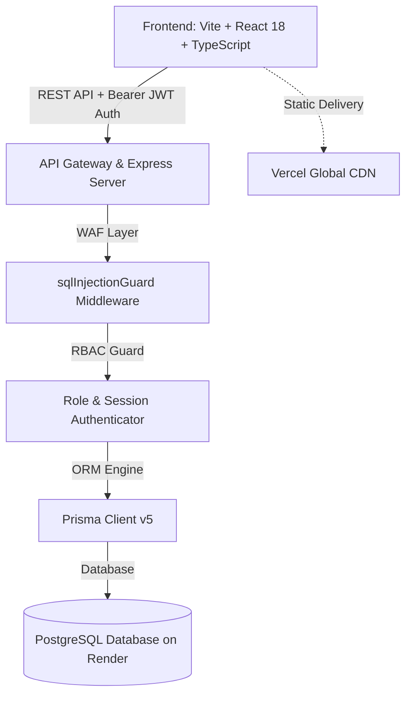

# 🛍️ AFREEN MALL — Enterprise POS & Operations Platform

> **Military-Grade, Bank-Secured Point of Sale & Retail ERP System**  
> Engineered for High-Volume Retail Superstores, Hypermarkets, and Multi-Counter Enterprise Malls.

---

---

## 📑 Table of Contents
1. [System Architecture & Monorepo Overview](#-system-architecture--monorepo-overview)
2. [Seeded Official Staff & Credential Directory](#-seeded-official-staff--credential-directory)
3. [Deep Feature Catalog (Minor to Major)](#-deep-feature-catalog-minor-to-major)
   - [Module 1: High-Speed POS Billing & Checkout](#1-high-speed-pos-billing--checkout)
   - [Module 2: Return & Exchange Management](#2-return--exchange-management)
   - [Module 3: Cash Management & BNA Vault Accounting](#3-cash-management--bna-vault-accounting)
   - [Module 4: Day Close & Shift Handover Reporting](#4-day-close--shift-handover-reporting)
   - [Module 5: Inventory & Warehouse Master](#5-inventory--warehouse-master)
   - [Module 6: Procurement & Purchase Order Management (PO / GRN)](#6-procurement--purchase-order-management-po--grn)
   - [Module 7: Accounting & Financial Governance](#7-accounting--financial-governance)
   - [Module 8: HR & Staff Administration](#8-hr--staff-administration)
   - [Module 9: Customer Relationship Management (CRM) & Loyalty](#9-customer-relationship-management-crm--loyalty)
   - [Module 10: Business Intelligence & Executive Analytics](#10-business-intelligence--executive-analytics)
   - [Module 11: Military & Bank-Grade Security Hardening](#11-military--bank-grade-security-hardening)
   - [Module 12: Zero-Mouse Keyboard Operability (WCAG Compliant)](#12-zero-mouse-keyboard-operability-wcag-compliant)
4. [Keyboard Shortcut Command Matrix](#-keyboard-shortcut-command-matrix)
5. [Environment Variables & Deployment](#-environment-variables--deployment)

---

## 🏛️ System Architecture & Monorepo Overview

### Monorepo Workspaces:
- **`apps/web`**: High-performance React 18 frontend with Times New Roman classic styling, custom Emerald Dark/Light themes, zero-mouse keyboard focus engine, and anti-tamper security wrappers.
- **`apps/api`**: Express + TypeScript backend running on Node.js with WAF SQL injection firewall, bcrypt password hashing, dynamic database bootstrapper, and 12 departmental REST API controllers.
- **`packages/shared-types`**: Shared types, role enums, cart payloads, and financial calculation interfaces.

## 🌟 Deep Feature Catalog (Minor to Major)

### 1. High-Speed POS Billing & Checkout
- **Lightning-Fast Barcode Scanning**: Sub-millisecond item lookup by EAN-13, UPC, SKU, or Product Name.
- **Multi-Sale Type Support (`F2`)**: One-touch switching between **Retail Sale**, **Wholesale Billing**, and **Institutional Supply**.
- **Instant Item Repetition (`F3`)**: Quick increments of the last scanned item without re-scanning.
- **Dynamic GST Engine**: Automatic split and computation of CGST, SGST, IGST across 0%, 5%, 12%, 18%, and 28% slabs with HSN tracking.
- **Zero Price Prevention Guard**: Items with `₹0.00` price cannot be added to the cart; triggers an alert prompting price configuration in inventory master.
- **Unregistered Barcode Alert**: Uncataloged barcodes prompt an immediate red alert modal (*"Barcode not found in store catalog"*).
- **Cart Deletion Safeguard (1-Item Minimum)**: Individual items can be removed down to 1 item. The last item requires clicking **Cancel Bill** to confirm full cart reset.
- **Multi-Mode Payment Terminal**:
  - 💵 **Cash**: Interactive change calculator with instant tender return calculation.
  - 💳 **Card / EDC**: Bank transaction code capture and slip reconciliation.
  - 📱 **UPI QR (`F7`)**: Instant dynamic UPI QR code generator for direct mobile payments.
  - 🔀 **Split Tender**: Combine Cash + UPI + Card on a single transaction invoice.
- **Active Cart Session Lock Guard**: Prevents accidental tab close or page navigation while an active bill is in progress (`beforeunload` protection).
- **POS Terminal Auto-Feed**: Interactive `[ POS-01 ]` counter badge in top header allowing switching between counters (`POS-01`, `POS-02`, `POS-03`).
- **Automated Thermal Auto-Print**: Automatically sends print command (`window.print()`) 400ms after payment confirmation.

---

### 2. Return & Exchange Management
- **Dedicated Sale Return Mode (`Alt + F11`)**: Switch POS terminal into item return and refund processing mode.
- **Cashier Return Access Guard (`canProcessSaleReturn`)**: By default, Cashiers are restricted to sales only. Attempting returns without authorization shows a permission error requiring Manager override.
- **Original Invoice Verification**: Validates invoice number, original purchase date, and return quantity against sold quantity.
- **Automated Inventory Restocking**: Returned products automatically restock into available floor inventory.
- **Credit Note & Cash Refund Management**: Supports credit notes, exchange against new cart items, or cash refund disbursement.

---

### 3. Cash Management & BNA Vault Accounting
- **Cash In / Cash Out Petty Cash Engine**: Log daily petty expenses (tea, cleaning, maintenance, transport) with approval reasons.
- **BNA (Bulk Note Acceptor) Machine Deposit Accounting**:
  - **Accounting Formula**: `Total Cash Sales = Counter Notes Cash + BNA Machine Cash`.
  - Cash deposited into in-store BNA machines is strictly categorized under **CASH** (never mixed into Card or UPI).
- **Physical Denomination Counter**: Full breakdown inputs for ₹2000, ₹500, ₹200, ₹100, ₹50, ₹20, ₹10, ₹5, ₹2, ₹1 notes & coins.
- **Cash Variance Detection**: Automatic calculation of **MATCHED**, **SHORT**, or **EXCESS** cash positions on every shift handover.
- **Safe Drop Records**: Transfer excess counter cash to the main vault during peak trading hours.

---

### 4. Day Close & Shift Handover Reporting
- **End-of-Day Z-Report**: Complete shift breakdown including Gross Sales, Net Sales, Tax Collection, Returns, and Net Cash Position.
- **Tender-Wise Reconciliation**: Side-by-side reconciliation of Cash vs Card vs UPI vs BNA Machine deposits.
- **Supervisor Sign-Off**: Mandatory digital sign-off by Cash Officer or Store Manager before register closure.
- **Audit Export**: Instant PDF and Excel export for store accounting and tax filing.

---

### 5. Inventory & Warehouse Master
- **SKU & Barcode Management**: Create and track products with barcodes, HSN codes, category, brand, and unit metrics (PCS, KG, LTR).
- **Real-Time Stock Depletion**: Every POS sale instantly updates live stock quantities across counters.
- **Batch & Expiry Date Tracking**: Automated warnings for near-expiry products and FIFO stock management.
- **Low Stock & Reorder Triggers**: Automatic reorder level alerts when stock drops below threshold.
- **Warehouse Floor Transfers**: Multi-stage transfer workflow between Main Warehouse and Retail Floor counters.
- **Physical Stock Audit (Stock Taking)**: Cycle counting with discrepancy reporting and audit logging.

---

### 6. Procurement & Purchase Order Management (PO / GRN)
- **Supplier / Vendor Master**: Complete vendor directory with GSTIN, PAN, payment terms, and contact profiles.
- **Purchase Order (PO) Engine**: Multi-tier PO creation (`DRAFT` → `SUBMITTED` → `APPROVED` → `RECEIVED` → `COMPLETED`).
- **Goods Receipt Note (GRN) Inspection**: 3-way matching between PO, Delivery Challan, and Physical Stock count.
- **Landed Cost & Tax Calculation**: Auto-calculate landed cost per unit including freight, insurance, and GST input tax credit (ITC).
- **Purchase Return & Debit Notes**: Return damaged or defective goods directly to vendors with automated debit note generation.

---

### 7. Accounting & Financial Governance
- **Double-Entry General Ledger**: Auto-posted journal entries for sales, purchases, cash transfers, expenses, and returns.
- **Accounts Receivable (AR) & Accounts Payable (AP)**: Track credit sales to institutional clients and pending vendor bills.
- **GST R1 & 3B Tax Liability Engine**: Automated monthly and quarterly GST liability summaries.
- **Profit & Loss (P&L) Statement**: Real-time Gross Margin and Net Margin calculation.
- **Daily Cash Flow Tracker**: Inflow vs outflow monitoring across cash drawers, bank accounts, and BNA machines.

---

### 8. HR & Staff Administration
- **Staff Directory & 6-Digit ID System**: Centralized directory with auto-generated 6-digit staff IDs (`300000+`).
- **Super Admin Staff Password Management**:
  - Super Admin can reset or change the password of any staff member from the User Management panel.
  - Dedicated endpoint `POST /api/v1/admin/users/:id/reset-password`.
- **7-Day Inactivity Auto-Deactivation**: Staff accounts with no login activity for 7 consecutive days are automatically suspended.
- **Manager Reactivation Switch ("Turn ON")**: Store Managers and Super Admins can restore suspended accounts with one click.
- **Cashier Return Access Delegation**: Toggle `canProcessSaleReturn` per cashier individually.

---

### 9. Customer Relationship Management (CRM) & Loyalty
- **Customer Phone Lookup**: Sub-second customer profile retrieval at POS by 10-digit mobile number.
- **Loyalty Points Engine**: Automated point accrual per ₹100 spent with one-touch POS redemption.
- **Tiered Customer Classification**: Auto-tagging of **VIP**, **Regular**, **Wholesale**, and **Institutional** buyers.
- **Khata / Store Credit Ledger**: Digital credit ledger for regular customers with payment reminders.

---

### 10. Business Intelligence & Executive Analytics
- **Executive Real-Time KPI Dashboard**: Live sales, gross margin, net profit, transactions count, and average basket value.
- **Role Perspective Filters**: Switch dashboard view between **Executive / Owner**, **CFO / Finance**, **COO / Operations**, and **Store Manager**.
- **What-If Simulation Engine**: Interactive forecasting simulating the financial impact of price changes, discount variations, footfall shifts, and supplier cost fluctuations.
- **Departmental Scorecards**: Performance scorecards across Sales, Inventory, Cashier Efficiency, and Customer Retention.
- **AI-Powered Operational Insights**: Automated detection of dead stock, peak sales hours, fast-moving items, and cash anomalies.

---

### 11. Military & Bank-Grade Security Hardening
- **WAF SQL Injection Firewall (`sqlInjectionGuard.middleware.ts`)**: Global Web Application Firewall inspecting all HTTP bodies, queries, and params. Malicious SQL payloads (`' 1=1 --`, `UNION SELECT`, `; DROP`) are intercepted with **HTTP 403 Forbidden**.
- **Frontend Anti-Tampering Shield (`SecurityGuard.tsx`)**:
  - Right-click context menus strictly disabled.
  - Developer Tools shortcuts (`F12`, `Ctrl+Shift+I`, `Ctrl+Shift+J`, `Ctrl+Shift+C`, `Ctrl+U`, `Ctrl+S`) blocked.
  - Production console logging suppressed.
- **Strict Ephemeral Session Architecture**:
  - All JWT tokens are stored in `sessionStorage` (no persistent `localStorage`).
  - Closing the browser tab or window **instantly destroys the session**.
- **15-Minute Inactivity Auto-Logout Watchdog (`useIdleTimer.ts`)**: Automatically logs out idle sessions after 15 minutes without activity.
- **Brute-Force Account Lockout**: 5 failed login attempts trigger an automatic 15-minute account lockout and IP rate limiter block.
- **Manual Bill Recovery (`Shift + F8`)**: Allows Cash Officers to recover failed print bills using bank transaction IDs with live duplicate prevention.
- **Authorized Duplicate Copy Print (`Ctrl + F5`)**: Prints with prominent watermark `*** DUPLICATE COPY *** (NOT AN ORIGINAL RECEIPT)` and logs reprint count to immutable audit logs.
- **Immutable Audit Trail (`AuditLog`)**: Comprehensive logging of user, role, action, entity, before/after values, and justification reasons.

---

### 12. Zero-Mouse Keyboard Operability (WCAG Compliant)
- **100% Keyboard Operable**: Cashiers can perform complete billing, item search, quantity adjustments, tender selection, and printing without touching a mouse.
- **Centralized Shortcut Registry (`shortcutRegistry.ts`)**: Collision-free shortcut engine avoiding browser-reserved keys.
- **WCAG 2.4.7 Focus Indicator**: High-contrast 3:1 emerald outline (`outline: 2px solid var(--accent-lime)`) across all active inputs, buttons, and rows.
- **WCAG 2.1.2 Modal Focus Trap (`useFocusTrap.ts`)**: Traps `Tab` / `Shift + Tab` cycling within open modals and restores focus upon modal close.
- **Full Numeric Keypad Support**: Complete support for `NumpadEnter` and `NumpadDecimal`.

---

## ⌨️ Keyboard Shortcut Command Matrix

| Shortcut | Action | Scope | Description |
|---|---|---|---|
| **`F1`** | **Help Legend** | Global POS | Opens full keyboard shortcut guide modal. |
| **`F2`** | **Sale Type Switch** | POS Cart | Cycles between Retail, Wholesale, and Institutional. |
| **`F3`** | **Repeat Last Item** | POS Cart | Instantly increments quantity of the last scanned product. |
| **`F7`** | **Instant UPI Payment** | Checkout | Launches dynamic UPI QR code generator modal. |
| **`F10`** | **Quick Cash Checkout** | Checkout | Confirms full cash payment and triggers thermal receipt print. |
| **`Shift + F8`** | **Manual Bill Recovery** | Supervisor | Recovers bill from successful bank EDC/UPI transaction ID. |
| **`Ctrl + F5`** | **Print Duplicate Bill** | Supervisor | Generates watermarked Duplicate Copy with audit logging. |
| **`Alt + F11`** | **Sale Return Mode** | POS Screen | Toggles between Sale Mode and Return Mode (Role Guarded). |
| **`Escape`** | **Close / Dismiss** | Modals | Closes active modals and returns focus to barcode input. |

### 💎 Crafted with Passion by **Gous Organisation**

*Chief Software Architect: **Gous Khan** · Afreen Mall Enterprise Platform*  
📞 **Mobile**: `+91 8625076618` | ✉️ **Email**: `gousk2004@gmail.com`

